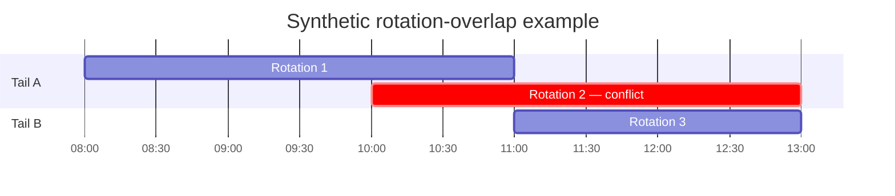

# Airline fleet-assignment optimisation

> **Sanitised technical case study.** This repository presents the architecture, modelling approach and validation principles behind a production airline decision-support system I developed. All examples are synthetic or approved for public use; proprietary data, commercial logic and production implementation details are excluded.

## Overview

| | |
|---|---|
| **Decision problem** | Assign aircraft across a planning horizon while balancing economic and fuel outcomes. |
| **Approach** | Predictive modelling, mixed-integer programming and ε-constraint multi-objective optimisation. |
| **Validation** | 43-fold walk-forward evaluation with a 3-day embargo over approximately 2 million historical flight records. |
| **Validated model performance** | 4.96% fuel MAPE and 5.54% airborne-hours MAPE under walk-forward validation. |
| **Operational impact** | Identified approximately **$3.25m** in operating-cost opportunity since production go-live; approximately **$1.75m** was actioned operationally. |
| **Delivery environment** | Python, LightGBM, MIP, Databricks, FastAPI and Docker. |

## The decision problem

Aircraft of the same type can differ in fuel efficiency and cost characteristics. A schedule, however, is not necessarily constructed around those differences. Reassigning one aircraft changes the availability and value of the remaining choices, so a locally attractive swap can create a worse network-level outcome.

The challenge is therefore to select a coherent, feasible portfolio of assignment decisions—not simply rank individual opportunities—while making the cost/fuel trade-off understandable to operational stakeholders.

## How the formulation evolved

The system did not begin as a mixed-integer programme. An initial linear-assignment formulation was suitable for simple one-to-one matching, but became insufficient as operational eligibility rules and competing objectives were introduced.

The optimisation architecture consequently evolved through successive practical constraints:

**linear assignment → feasibility-aware MIP → ε-constraint multi-objective optimisation → automated frontier selection**

An important part of the development was testing assumptions rather than treating an established formulation as fixed. This included correcting evaluation leakage in the predictive layer and revisiting the mathematical justification for a frontier-selection method after empirical and analytical testing contradicted the original rationale.

## Optimisation model

At its core, the system uses **mixed-integer programming (MIP)** to select mutually compatible assignment decisions. Rather than collapsing cost and fuel into an arbitrary single score, the model uses an **ε-constraint formulation**:

$$
\begin{aligned}
\min_{x \in \mathcal{X}} \quad & F(x) \\
\text{subject to} \quad & C(x) \leq C^*(1 + \varepsilon)
\end{aligned}
$$

Here, $F(x)$ represents the fuel-performance outcome, $C(x)$ the economic outcome, and $C^*$ the minimum achievable economic objective. The parameter $\varepsilon$ controls the permitted proportional relaxation from that cost optimum.

Varying $\varepsilon$ produces an efficient-frontier-style set of alternatives. This allows stakeholders to see the marginal cost/fuel trade-off explicitly, rather than receiving a black-box recommendation.

The public material intentionally stops at this level. Objective construction, coefficients, constraint definitions, candidate generation and solver configuration are excluded.

## Predictive layer

The decision model is supplied with data-driven estimates of aircraft and flight performance. A pooled **LightGBM** approach supports the predictive inputs across aircraft types, evaluated using a time-aware validation design:

- approximately 2 million historical flight records;
- 43 walk-forward test folds;
- a 3-day embargo between training and test periods to reflect the decision horizon; and
- walk-forward validation errors of 4.96% MAPE for fuel and 5.54% MAPE for airborne hours.

The model-development workflow also includes train/serve consistency checks to reduce the risk of feature mismatch between evaluation and live use.

## Performance attribution and validation

The optimisation layer and evaluation layer are intentionally distinct. Beyond estimating decision inputs, the work includes a post-decision methodology for comparing identified, actioned and realised outcomes, alongside independent financial reconciliation.

Validation and self-correction have been treated as first-class engineering work:

- a cross-fold leakage issue in a derived feature was identified and corrected by rebuilding it within each training fold;
- recommended decision sets are checked for feasibility and integrity before presentation;
- results are evaluated through time-aware historical testing rather than a random split; and
- a frontier-selection rationale was challenged, tested analytically and empirically, then corrected when the evidence did not support the original explanation.

These checks matter because a model can appear statistically strong while still being unsuitable for operational decision-making.

## Production delivery

The system runs as a scheduled Databricks workflow, with governed data assets in Unity Catalog and a user-facing Databricks App. Recommendations are generated on a daily cadence and reviewed by operations before implementation.

The design goal is transparent, reviewable decision support: stakeholders can interrogate how expected benefit changes as the acceptable cost/fuel trade-off changes.

## Operational impact

Since production go-live, the system identified approximately **$3.25m** in operating-cost opportunity. Approximately **$1.75m** was actioned operationally.

These figures communicate the scale of operational adoption; they do not disclose the underlying cost base, rate cards, commercial arrangements or decision rules.

## Ongoing optimisation research

Beyond the current production Line-of-Flying assignment problem, I am developing a rotation-level formulation that treats connected flight sequences and aircraft availability as a time-space optimisation problem.

At this level, assignments can no longer be treated as independent one-to-one matches. A tail allocated to one rotation becomes unavailable to temporally overlapping rotations, introducing explicit resource coupling across the planning horizon.

**Synthetic overlap example.** Rotations 1 and 2 overlap in time, so they cannot both be assigned to Tail A.

The conflict is expressed as $x_{1A} + x_{2A} \leq 1$.

A simplified public formulation is:

$$
\begin{aligned}
\min_x \quad & \sum_{r \in \mathcal{R}} \sum_{a \in \mathcal{A}} c_{ra}x_{ra} \\
\text{subject to} \quad & \sum_{a \in \mathcal{A}} x_{ra} = 1
&& \forall r \in \mathcal{R} \\
& x_{ra} + x_{sa} \leq 1
&& \forall a \in \mathcal{A},\ (r,s) \in \mathcal{C} \\
& x_{ra} = 0
&& \forall (r,a) \notin \mathcal{E} \\
& x_{ra} \in \{0,1\}.
\end{aligned}
$$

Here, $x_{ra}=1$ assigns aircraft $a$ to rotation $r$; $\mathcal{C}$ represents pairs of rotations that conflict in time; and $\mathcal{E}$ represents feasible rotation–aircraft assignments. The public objective $c_{ra}$ is deliberately abstracted from the real cost construction. Fixed operational anchors are represented by fixing selected decision variables.

The important structural change is the interval-conflict constraint. The underlying one-to-one assignment formulation has an integral LP relaxation; introducing cross-rotation resource conflicts breaks that structure in the current formulation. In a representative operational test, the LP relaxation returned **206 fractional decision variables**, confirming that the LP relaxation is insufficient for this formulation and that integrality must be enforced explicitly.

The research is also exploring string- and network-based representations of connected flying, where a rotation is treated as a reusable decision unit within a time-space network. This creates a path toward richer problems involving aircraft continuity, positioning, technical feasibility and, eventually, disruption propagation.

The current formulation has been tested against independently reconstructed operational inputs, with exact status-quo feasibility checks and explicit post-solve assertions against unauthorised overlap. It remains exploratory rather than productionised, and no savings figures from this work are included in the production impact reported above.

## Technology

- **Data and platform:** Databricks (Apps, Lakeflow, Unity Catalog, SDK, SQL)
- **Optimisation and ML:** Python, LightGBM, mixed-integer programming
- **Application and services:** FastAPI
- **Engineering workflow:** Git, `uv`, Docker

## Public repository scope

This repository may contain high-level architecture, representative optimisation patterns, validation methodology and synthetic examples. It deliberately excludes:

- proprietary operational, fleet, flight, performance and commercial data;
- real cost construction, calibration logic and rate cards;
- operational constraints, business rules and candidate-generation details;
- production code, notebooks, model artefacts, configuration, credentials and infrastructure; and
- exact production objective coefficients, thresholds, solver settings and validation datasets.

The case study demonstrates the full decision-science lifecycle: translating an ambiguous operational problem into predictive inputs, a constrained mathematical decision model, robust validation, production delivery and measurable operational adoption.
